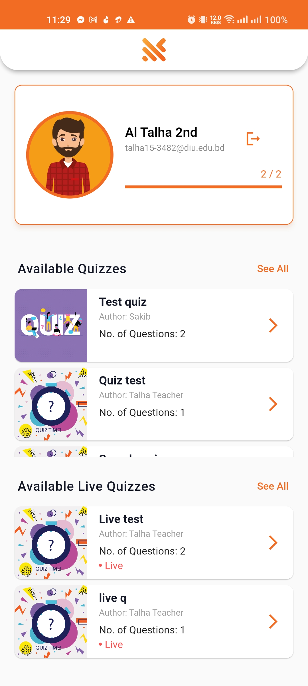

# QuizI

A quiz application, where 
* a teacher can create live and non-live quizzes
* a student can attend any quiz and see his/her score


## Screenshots of the android application

Part by part screenshots are following:

* #### Simple Home Screen
  

* #### Auth Screens
    

* #### Student Dashboard
   

* #### Teacher Dashboard
  

* #### Create Quizzes 
    

* #### Play Quizzes
     


## Downloadable Apk files

* [Google Drive Link](https://drive.google.com/drive/folders/1JWQl1wj4nBEXdqrKvK9uomXA0LHXu4am?usp=sharing)

## Used flutter packages 

```
   loading_animation_widget: ^1.2.0+4
   get: ^4.6.5
   firebase_core: ^2.14.0
   firebase_storage: ^11.2.3
   cloud_firestore: ^4.8.1
   firebase_auth: ^4.6.3
   firebase_database: ^10.2.3
   get_storage: ^2.1.1
   email_validator: ^2.1.17
   molten_navigationbar_flutter: ^1.0.1
   uuid: ^3.0.7
   intl: ^0.18.1
```

